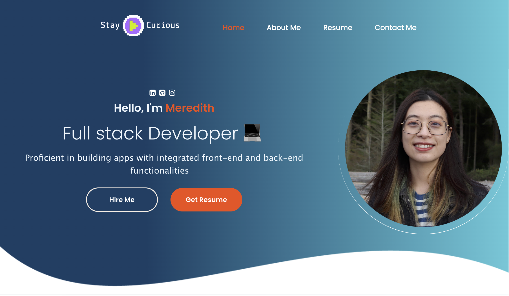
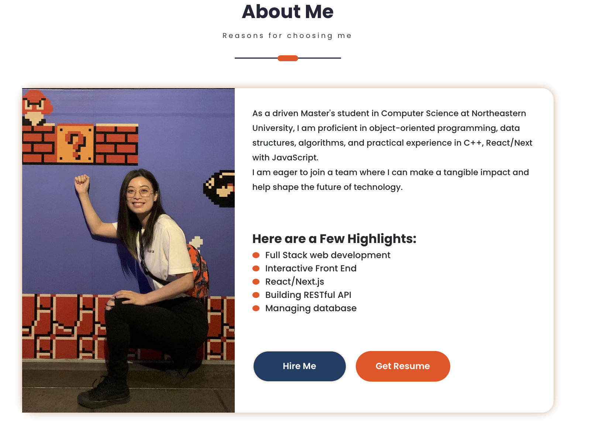
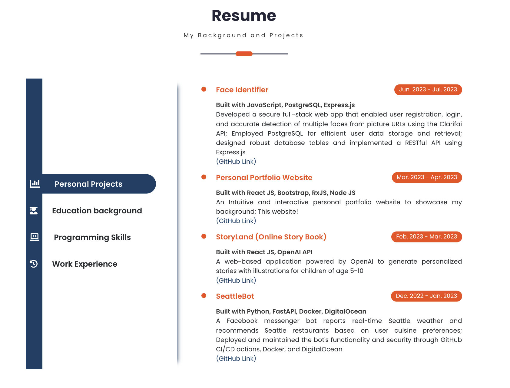
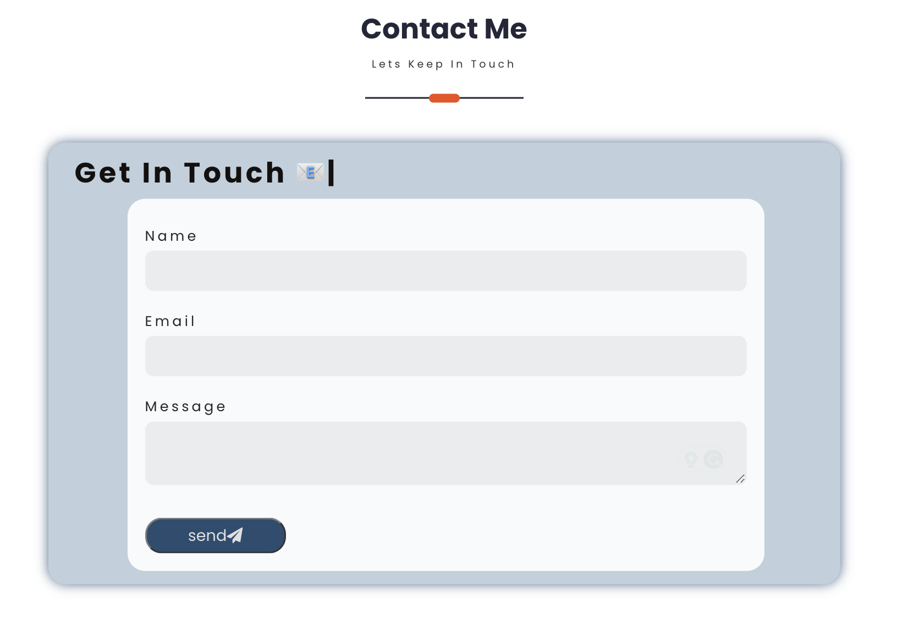

# Personal Portfolio Website

This project is an intuitive and interactive personal portfolio website built using React.js, Bootstrap, and RxJS. The website serves as a showcase of skills, projects, and experiences. It also features a contact form that enables users to get in touch through email.

## Screenshots

    
    
    
    

## Getting Started

To run the project locally, follow these steps:

1. **Clone the repository:** Begin by cloning this repository to your local machine using the following command: `git clone https://github.com/mereluo/portfoliomere.git`

2. **Install Dependencies:** Navigate to the project directory and install the necessary dependencies using npm:
   `cd portfoliomere`
   `npm install`
   `cd client`
   `npm install`

4. **Start the Development Server:** Once the dependencies are installed, start the development server: `npm start`

The website should now be accessible on `http://localhost:3000` in your web browser.

## License

This project is licensed under the MIT License. See the [LICENSE](LICENSE) file for details.
